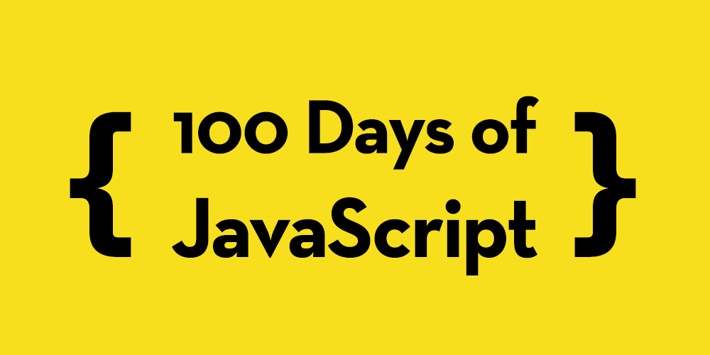

_100 Days of JavaScript_ is a personal project where I commit to coding and sharing a new JavaScript project or concept every day for 100 days. Through this journey, I aim to deepen my understanding of JavaScript, explore its vast possibilities, and enhance my programming skills.

# Projects:

1. [Javascript Quote Generator](https://alin-trinca.github.io/100-Days-of-Javascript/001%20Javascript%20Quote%20Generator/dist/index.html)
2. [Javascript Modal Window](https://alin-trinca.github.io/100-Days-of-Javascript/002%20Javascript%20Modal%20Window/dist/index.html)
3. [Javascript Infinite Scroll](https://alin-trinca.github.io/100-Days-of-Javascript/003%20Javascript%20Infinite%20Scroll/dist/index.html)
4. [Javascript Digital Clock](https://alin-trinca.github.io/100-Days-of-Javascript/004%20Javascript%20Digital%20Clock/dist/index.html)
5. [Navigation UI Animation](https://alin-trinca.github.io/100-Days-of-Javascript/005%20Navigation%20UI%20Animation/dist/index.html)
6. [Javascript Picture in Picture](https://alin-trinca.github.io/100-Days-of-Javascript/006%20Javascript%20Picture%20in%20Picture/dist/index.html)
7. [Javascript Custom Countdown](https://alin-trinca.github.io/100-Days-of-Javascript/007%20Javascript%20Custom%20Countdown/dist/index.html)
8. [Javascript Analog Clock](https://alin-trinca.github.io/100-Days-of-Javascript/008%20Javascript%20Analog%20Clock/dist/index.html)
9. [Javascript Crypto Price App](https://alin-trinca.github.io/100-Days-of-Javascript/009%20Javascript%20Crypto%20Price%20App/dist/index.html)
10. [Javascript Gradient Generator](https://alin-trinca.github.io/100-Days-of-Javascript/010%20Javascript%20Gradient%20Generator/dist/index.html)
11. [Javascript Password Generator](https://alin-trinca.github.io/100-Days-of-Javascript/011%20Javascript%20Password%20Generator/dist/index.html)
12. [Javascript Aspect Ratio Calculator](https://alin-trinca.github.io/100-Days-of-Javascript/012%20Javascript%20Aspect%20Ratio%20Calculator/dist/index.html)
13. [Javascript Weather App](https://alin-trinca.github.io/100-Days-of-Javascript/013%20Javascript%20Weather%20App/dist/index.html)
14. [Javascript Tradingview API](https://alin-trinca.github.io/100-Days-of-Javascript/014%20Javascript%20Tradingview%20API/dist/index.html)
15. [Javascript Internet Speed Test](https://alin-trinca.github.io/100-Days-of-Javascript/015%20Javascript%20Internet%20Speed%20Test/dist/index.html)
16. [Javascript Box Shadow Generator](https://alin-trinca.github.io/100-Days-of-Javascript/016%20Javascript%20Box%20Shadow%20Generator/dist/index.html)
17. [Light & Dark Mode](https://alin-trinca.github.io/100-Days-of-Javascript/017%20Light%20&%20Dark%20Mode/dist/index.html)
18. [Javascript Chart](https://alin-trinca.github.io/100-Days-of-Javascript/018%20Javascript%20Chart/dist/index.html)
19. [Javascript Video Player](https://alin-trinca.github.io/100-Days-of-Javascript/019%20Javascript%20Video%20Player/dist/index.html)
20. [Javascript Recipe Guide](https://alin-trinca.github.io/100-Days-of-Javascript/020%20Javascript%20Recipe%20Guide/dist/index.html)
21. [Javascript Music Player](https://alin-trinca.github.io/100-Days-of-Javascript/021%20Javascript%20Music%20Player/dist/index.html)
22. [Javascript Form Validator](https://alin-trinca.github.io/100-Days-of-Javascript/022%20Javascript%20Form%20Validator/dist/index.html)
23. [Javascript Add Bookmark](https://alin-trinca.github.io/100-Days-of-Javascript/023%20Javascript%20Add%20Bookmark/dist/index.html)
24. [Javascript Slider](https://alin-trinca.github.io/100-Days-of-Javascript/024%20Javascript%20Slider/dist/index.html)
25. [Javascript Filter](https://alin-trinca.github.io/100-Days-of-Javascript/025%20Javascript%20Filter/dist/index.html)
26. [Javascript Marvel Quiz](https://alin-trinca.github.io/100-Days-of-Javascript/026%20Javascript%20Marvel%20Quiz/dist/index.html)
27. [Javascript Expanding Cards](https://alin-trinca.github.io/100-Days-of-Javascript/027%20Javascript%20Expanding%20Cards/dist/index.html)
28. [Javascript Blurry Loading](https://alin-trinca.github.io/100-Days-of-Javascript/028%20Javascript%20Blurry%20Loading/dist/index.html)
29. [Javascript Sound Board](https://alin-trinca.github.io/100-Days-of-Javascript/029%20Javascript%20Sound%20Board/dist/index.html)
30. [Javascript Currency Converter](https://alin-trinca.github.io/100-Days-of-Javascript/030%20Javascript%20Currency%20Converter/dist/index.html)
31. [Live User Filter](https://alin-trinca.github.io/100-Days-of-Javascript/031%20Live%20User%20Filter/dist/index.html)
32. [Javascript Hoverboard](https://alin-trinca.github.io/100-Days-of-Javascript/032%20Javascript%20Hoverboard/dist/index.html)
33. [Toast Notifications](https://alin-trinca.github.io/100-Days-of-Javascript/033%20Toast%20Notifications/dist/index.html)
34. [Vertical Slider](https://alin-trinca.github.io/100-Days-of-Javascript/034%20Vertical%20Slider/dist/index.html)
35. [Github Profiles](https://alin-trinca.github.io/100-Days-of-Javascript/035%20Github%20Profiles/dist/index.html)
36. [Pong Game](https://alin-trinca.github.io/100-Days-of-Javascript/036%20Pong%20Game/dist/index.html)
37. [Snake Game](https://alin-trinca.github.io/100-Days-of-Javascript/037%20Snake%20Game/dist/index.html)
38. [XO Game](https://alin-trinca.github.io/100-Days-of-Javascript/038%20XO%20Game/dist/index.html)
39. [Javascript Guess the Word](https://alin-trinca.github.io/100-Days-of-Javascript/039%20Javascript%20Guess%20the%20Word/dist/index.html)
40. [Pig Game](https://alin-trinca.github.io/100-Days-of-Javascript/040%20Pig%20Game/dist/index.html)
41. [Temperature Converter](https://alin-trinca.github.io/100-Days-of-Javascript/041%20Temperature%20Converter/dist/index.html)
42. [Random Number Generator](https://alin-trinca.github.io/100-Days-of-Javascript/042%20Random%20Number%20Generator/dist/index.html)
43. [Real Time Character Counter](https://alin-trinca.github.io/100-Days-of-Javascript/043%20Real%20Time%20Character%20Counter/dist/index.html)
44. [Javascript Monthly Calendar](https://alin-trinca.github.io/100-Days-of-Javascript/044%20Javascript%20Monthly%20Calendar/dist/index.html)
45. [Javascript Emoji Creator](https://alin-trinca.github.io/100-Days-of-Javascript/045%20Javascript%20Emoji%20Creator/dist/index.html)
46. [QR Code Generator](https://alin-trinca.github.io/100-Days-of-Javascript/046%20QR%20Code%20Generator/dist/index.html)
47. [Detect Device Battery](https://alin-trinca.github.io/100-Days-of-Javascript/047%20Detect%20Device%20Battery/dist/index.html)
48. [Geometric Art Generator](https://alin-trinca.github.io/100-Days-of-Javascript/048%20Geometric%20Art%20Generator/dist/index.html)
49. [Spin the Wheel](https://alin-trinca.github.io/100-Days-of-Javascript/049%20Spin%20the%20Wheel/dist/index.html)
50. [Animated Template](https://alin-trinca.github.io/100-Days-of-Javascript/050%20Animated%20Template/dist/index.html)
51. [Math Sprint Game](https://alin-trinca.github.io/100-Days-of-Javascript/051%20Math%20Sprint%20Game/dist/index.html)
52. [Multi Step Form](https://alin-trinca.github.io/100-Days-of-Javascript/052%20Multi%20Step%20Form/dist/index.html)
53. [Drag n' Drop](https://alin-trinca.github.io/100-Days-of-Javascript/053%20Drag%20n'%20Drop/dist/index.html)
54. [Javascript Calculator](https://alin-trinca.github.io/100-Days-of-Javascript/054%20Javascript%20Calculator/dist/index.html)
55. [Search Wikipedia](https://alin-trinca.github.io/100-Days-of-Javascript/055%20Search%20Wikipedia/dist/index.html)
56. [Color Flipper](https://alin-trinca.github.io/100-Days-of-Javascript/056%20Color%20Flipper/dist/index.html)
57. [Javascript Simple Counter](https://alin-trinca.github.io/100-Days-of-Javascript/057%20Javascript%20Simple%20Counter/dist/index.html)
58. [Javascript Reviews](https://alin-trinca.github.io/100-Days-of-Javascript/058%20Javascript%20Reviews/dist/index.html)
59. [Javascript Lorem Ipsum](https://alin-trinca.github.io/100-Days-of-Javascript/059%20Javascript%20Lorem%20Ipsum/dist/index.html)
60. [Javascript Dad Jokes](https://alin-trinca.github.io/100-Days-of-Javascript/060%20Javascript%20Dad%20Jokes/dist/index.html)
61. [Javascript CountTo](https://alin-trinca.github.io/100-Days-of-Javascript/061%20Javascript%20CountTo/dist/index.html)
62. [Javascript Grocery List](https://alin-trinca.github.io/100-Days-of-Javascript/062%20Javascript%20Grocery%20List/dist/index.html)
63. [Internet Connection Detector](https://alin-trinca.github.io/100-Days-of-Javascript/063%20Internet%20Connection%20Detector/dist/index.html)
64. [Animated Vertical Tabs](https://alin-trinca.github.io/100-Days-of-Javascript/064%20Animated%20Vertical%20Tabs/dist/index.html)
65. [Before After Slider](https://alin-trinca.github.io/100-Days-of-Javascript/065%20Before%20After%20Slider/dist/index.html)
66. [Javascript Typing Effect](https://alin-trinca.github.io/100-Days-of-Javascript/066%20Javascript%20Typing%20Effect/dist/index.html)
67. [Custom Captcha Generator](https://alin-trinca.github.io/100-Days-of-Javascript/067%20Custom%20Captcha%20Generator/dist/index.html)
68. [Password Validation Check](https://alin-trinca.github.io/100-Days-of-Javascript/068%20Password%20Validation%20Check/dist/index.html)
69. [Animated Shiny Loader](https://alin-trinca.github.io/100-Days-of-Javascript/069%20Animated%20Shiny%20Loader/dist/index.html)
70. [Javascript Type Test](https://alin-trinca.github.io/100-Days-of-Javascript/070%20Javascript%20Type%20Test/dist/index.html)
71. [Javascript Translator](https://alin-trinca.github.io/100-Days-of-Javascript/071%20Javascript%20Translator/dist/index.html)
72. [Text to Speech](https://alin-trinca.github.io/100-Days-of-Javascript/072%20Text%20to%20Speech/dist/index.html)
73. [Purple Heart Rain](https://alin-trinca.github.io/100-Days-of-Javascript/073%20Purple%20Heart%20Rain/dist/index.html)
74. [Zoom Effect](https://alin-trinca.github.io/100-Days-of-Javascript/074%20Zoom%20Effect/dist/index.html)
75. [Javascript Particles](https://alin-trinca.github.io/100-Days-of-Javascript/075%20Javascript%20Particles/dist/index.html)
76. [Find the Winner](https://alin-trinca.github.io/100-Days-of-Javascript/076%20Find%20the%20Winner/dist/index.html)
77. [Panda Eyes](https://alin-trinca.github.io/100-Days-of-Javascript/077%20Panda%20Eyes/dist/index.html)
78. [Content Placeholder](https://alin-trinca.github.io/100-Days-of-Javascript/078%20Content%20Placeholder/dist/index.html)
79. [Testimonial Design](https://alin-trinca.github.io/100-Days-of-Javascript/079%20Testimonial%20Design/dist/index.html)
80. [Background Slider](https://alin-trinca.github.io/100-Days-of-Javascript/080%20Background%20Slider/dist/index.html)
81. [Javascript Waves](https://alin-trinca.github.io/100-Days-of-Javascript/081%20Javascript%20Waves/dist/index.html)
82. [Rain Drops](https://alin-trinca.github.io/100-Days-of-Javascript/082%20Rain%20Drops/dist/index.html)
83. [Traffic Lights](https://alin-trinca.github.io/100-Days-of-Javascript/083%20Traffic%20Lights/dist/index.html)
84. [Sortable List](https://alin-trinca.github.io/100-Days-of-Javascript/084%20Sortable%20List/dist/index.html)
85. [Good, Cheap & Fast](https://alin-trinca.github.io/100-Days-of-Javascript/085%20Good,%20Cheap%20&%20Fast/dist/index.html)
86. [Flashlight Effect](https://alin-trinca.github.io/100-Days-of-Javascript/086%20Flashlight%20Effect/dist/index.html)
87. [Javascript Stopwatch](https://alin-trinca.github.io/100-Days-of-Javascript/087%20Javascript%20Stopwatch/dist/index.html)
88. [Javascript Age Calculator](https://alin-trinca.github.io/100-Days-of-Javascript/088%20Javascript%20Age%20Calculator/dist/index.html)
89. [Number to Roman Generator](https://alin-trinca.github.io/100-Days-of-Javascript/089%20Number%20to%20Roman%20Generator/dist/index.html)
90. [Javascript 2048 Game](https://alin-trinca.github.io/100-Days-of-Javascript/088%20Javascript%202048%20Game/dist/index.html)

